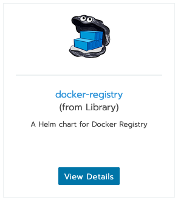
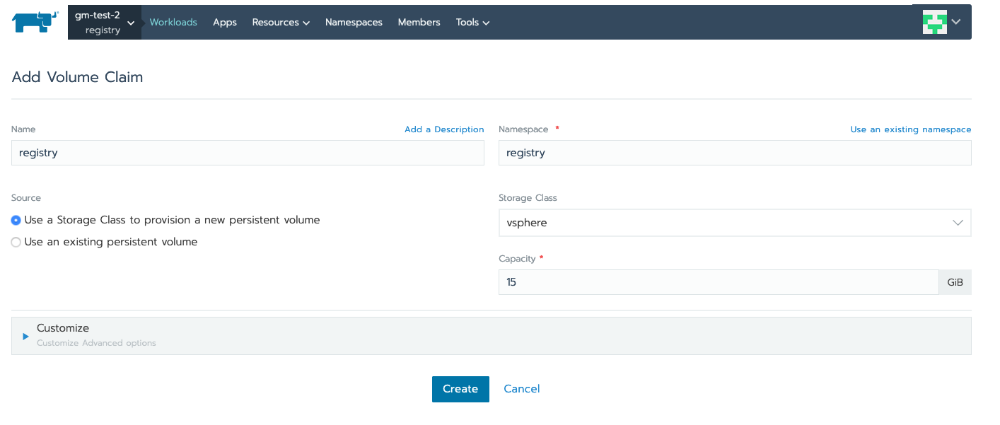
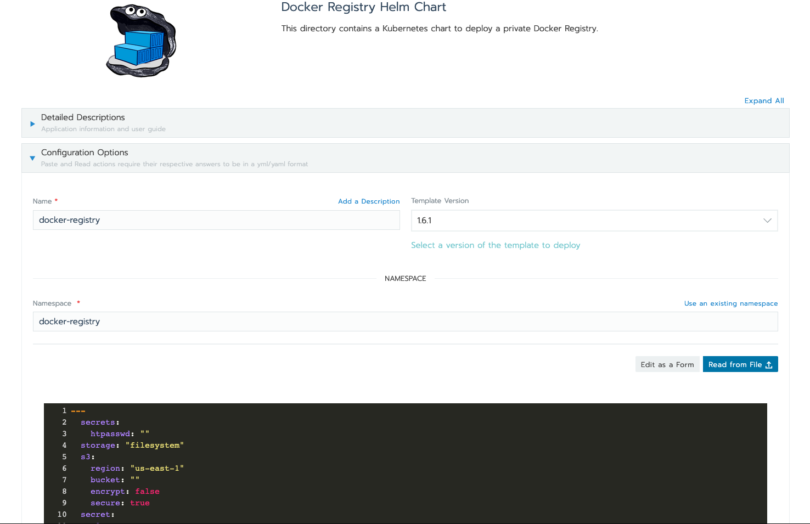

## Running docker registry on K8S: An Example

For the purpose of this example we will be using the docker registry helm chart available in the catalog.



A docker registry needs to have persistent storage available to store the container image layers.

The docker registry needs a persistent store for storing container images, unless this registry is only for testing purposes.

The list of supported docker registry drivers is available [here.](https://docs.docker.com/registry/storage-drivers/)

For the purpose of this demo we will use the **FileSystem** driver, which allows the registry to use a local file system. 

The helm chart needs a Persistent Volume for use with the FileSystem option. 

The chart requires that the persistent volume is already available before the chart is deployed.

The users need to ensure that the appropriate cloud credentials are available for use in your K8S cluster.

For the purpose of this example we already have a cluster using the vsphere cloud provider.

We can create a PVC from the Rancher UI, as shown:




Another pre-requisite for the docker-registry is an authentication user and password.

This can be easily created using the existing **registry** container image

For this example we will create a user named **demo** which can authenticate with the password **demopassword**

```
docker run --entrypoint htpasswd registry:2 -Bbn demo demopassword > htpasswd
```


This password can now be used in the variable updates for the chart.

Since there are a few changes involved, it is easier to perform this change via the `helm` cli.


Following is the sample values-override.yaml that was created for this demo:

```
---
  secrets:
    htpasswd: "demo:$2y$05$24spSdHXDzYh5ar.8FX6BONx2oAx0xmRiMnt8sBhx7eDR57uGWAji"
  storage: "filesystem"
  persistence:
    enabled: true
    size: "15Gi"
    storageClass: "vsphere"
    existingClaim: "registry"
  ingress:
    enabled: true
    path: /
  # Used to create an Ingress record.
    hosts:
      - registry.local
    annotations:
      kubernetes.io/ingress.class: nginx
      certmanager.k8s.io/issuer: "selfsigning-issuer"
      nginx.ingress.kubernetes.io/proxy-body-size: "0"
    labels: {}
    tls:
      # Secrets must be manually created in the namespace.
      - secretName: registry-tls
        hosts:
          - registry.local
  service:
    type: "ClusterIP"
    nodePort: ""
```

The overrides indicate the following:

* Specification for the htpassword, which was created using the `registry:2` container image from the step before.

* Persistence using vsphere driver, and using the filesystem storage.

* Ingress spec, to allow access to the registry, including some additional ingress annotations:
    * We have setup a selfisigning-issuer to issue a cert.
    * The `nginx.ingress.kubernetes.io/proxy-body-size: "0"` is needed to ensure that there is no limit on the message size. This is needed to avoid issues during image pushes.

* ServiceType is cluster, since we will be using L7 ingress to route requests to the registry.

Once the values-override.yaml has been setup the command for installation of the registry is as follows:

```
 helm install --name docker-registry stable/docker-registry -f values-override.yaml --namespace registry
```

This will install the helm chart and use the override values to deploy the components into the **registry** namespace.

In case you are using a self signed certificate, then please ensure that the insecure-registries on your local docker-daemon are setup to include the newly setup registry. In this particular case **registry.local**

To verify the registry, we will login to the registry using the username / password we setup in the htpasswd file.

```
▶ docker login -u demo registry.local
Password:
Login Succeeded
```

We can now push an image to this registry. We will just use an existing image for this test and re-tag it.

```
docker tag alpine:latest registry.local/alpine:latest
```

Now the push should be successful.

```
docker push registry.local/alpine:latest
The push refers to repository [registry.local/alpine]
03901b4a2ea8: Pushed
latest: digest: sha256:acd3ca9941a85e8ed16515bfc5328e4e2f8c128caa72959a58a127b7801ee01f size: 528
```

If the user wishes to not use the helm cli then the same setups can be performed from the rancher console by using the **Edit yaml** option and reading the settings from the override file.




